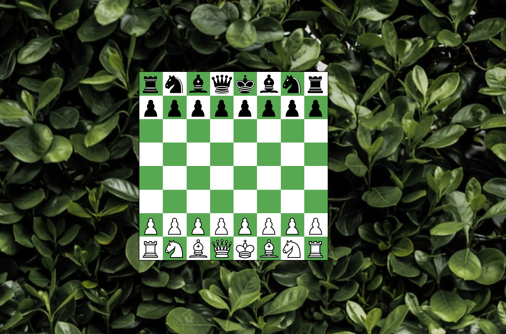

# Chess - web application

## Start

## Game

## Win

## Pawn on last row

# Description
* Chess web application that runs in the browser.
* Implemented with Javascript
* Data representation of the cells have the format ("A1")
* Cell data converts to integers while computing piece moves
* Chess pieces and game state was implemented as objects